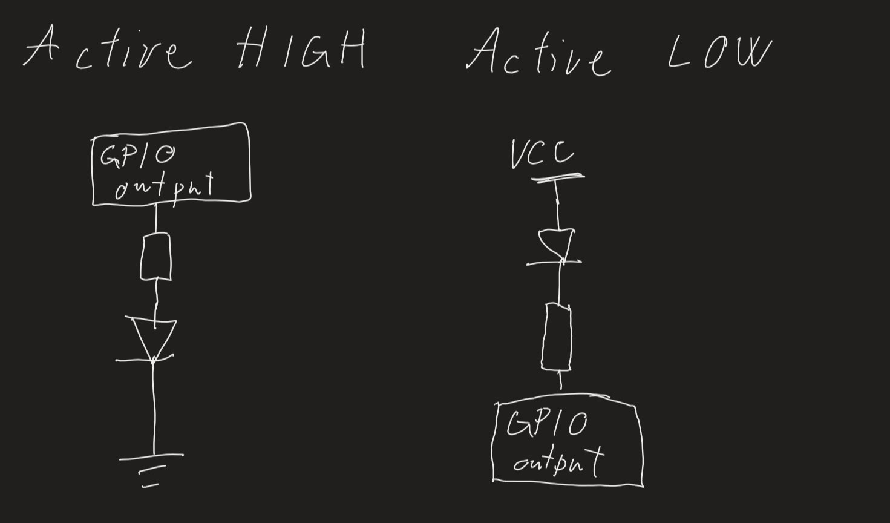
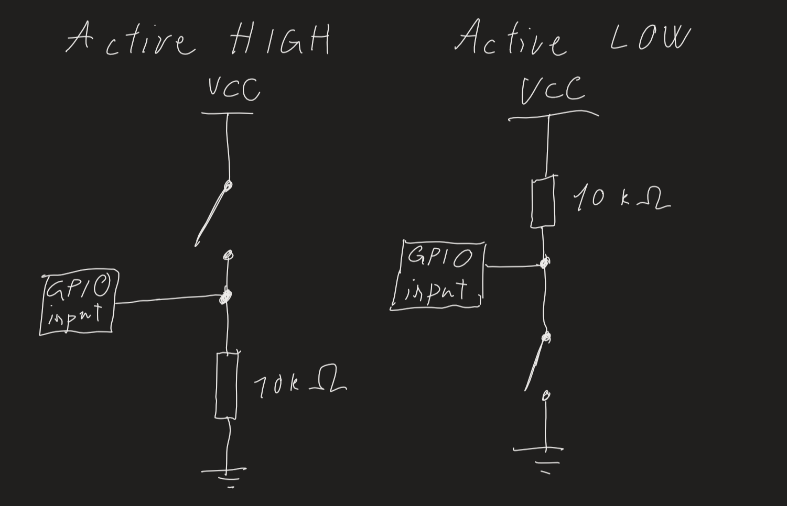

# Lab 2: Control of GPIO, LED, push button

## Preparation

1. Draw two basic ways to connect a LED to the output pin of the microcontroller: LED active-low, LED active-high.

 

2. [Calculate LED resistor value](https://electronicsclub.info/leds.htm) for typical LEDs. Let the LED current is 20 milli amps.

   | **LED color** | **Supply voltage** | **LED current** | **LED voltage** | **Resistor value** |
   | :-: | :-: | :-: | :-: | :-: |
   | red | 5&nbsp;V | 20&nbsp;mA | 2&nbsp;V | 150&nbsp;ohm |
   | green | 5&nbsp;V | 20&nbsp;mA | 2.2&nbsp;V |140&nbsp;ohm |
   | blue | 5&nbsp;V | 20&nbsp;mA | 3.3&nbsp;V | 85&nbsp;ohm |

3. Draw the basic ways to connect a push button to the microcontroller input pin: button active-low, button active-high.

 
 
 1. Fill in the following table and enter the number of bits and numeric range for the selected data types defined by C.

   | **Data type** | **Number of bits** | **Range** | **Description** |
   | :-: | :-: | :-: | :-- |
   | `uint8_t`  | 8 | 0, 1, ..., 255 | Unsigned 8-bit integer |
   | `int8_t`   | 8 | -128, ..., 127 | Signed 8-bit integer |
   | `uint16_t` | 16 | 65 535 | Unsigned 16-bit integer |
   | `int16_t`  | 16 | -32 768, ..., 32 767 | Signed 16-bit integer |
   | `float`    | 8 | -3.4e+38, ..., 3.4e+38 | Single-precision floating-point |
   | `void`     | 0 | - | Data type for no data type |
