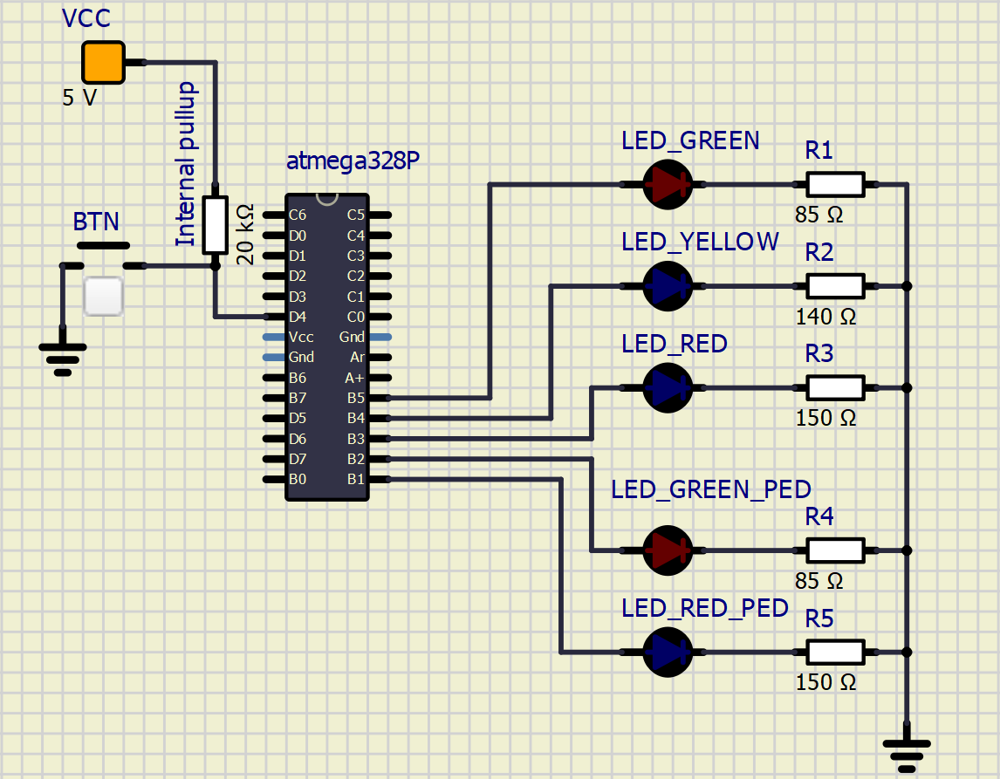

# Lab 2: Benjamin Nimmerrichter

### GPIO control registers

1. Complete the table for DDRB and PORTB control register values.

 | **DDRB** | **PORTB** | **Direction** | **Internal pull-up resistor** | **Description** |
   | :-: | :-: | :-: | :-: | :-- |
   | 0 | 0 | input | no | Tri-state, high-impedance |
   | 0 | 1 | input | yes |  |
   | 1 | 0 | output | no |  |
   | 1 | 1 | output | yes |  |

### GPIO library

2. Complete the table with code sizes from three versions of the blink application.

   | **Version** | **Size [B]** |
   | :-- | :-: |
   | Ver. 1: Arduino-style | 428  |
   | Ver. 2: Registers | 152 |
   | Ver. 3: Library functions | 176 |

### Traffic light

3. Scheme of traffic light application with one red/yellow/green light for cars, one red/green light for pedestrians, and one push button. Connect AVR device, LEDs, resistors, push button (for pedestrians), and supply voltage. The image can be drawn on a computer or by hand. Always name all components and their values!

   
